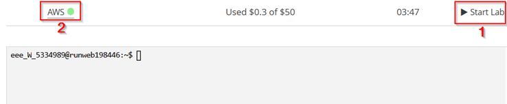
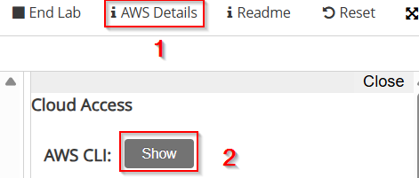
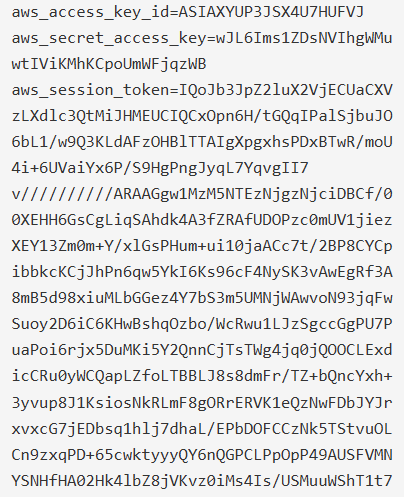
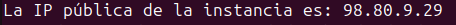

# Obligatorio_DevOps_2025_N4A_Martinez_Ourthe_Cabale
---
## Paso a paso para una correcta ejecución de los ejercicios 1 y 2
---
## Ejercicio 1
***Nota: Este ejercicio fue probado únicamente en la versión Ubuntu 24.04***

### 1. Instalación de Git (solo si no está instalado)

Si no tienes Git instalado en tu sistema, ejecuta:

```bash
sudo apt install git -y 
```
### 2. Clonar el repositorio del obligatorio
```bash
git clone https://github.com/mariourthecabale/Obligatorio_DevOps_2025_N4A_Martinez_Ourthe_Cabale.git
```
### 3. Posicionarse en la carpeta del Ejercicio 1
```bash
cd Obligatorio_DevOps_2025_N4A_Martinez_Ourthe_Cabale/Ejercicio_1
```
### 4. Ejecutar el script
Ejecutamos el script con todos los argumentos válidos.
La contraseña por defecto establecida es: 123456789
```bash
sudo ./ej1_crea_usuarios.sh -i -c "123456789" archivo_con_los_usuarios_a_crear.txt
```
---
## Ejercicio 2
***Nota: Este ejercicio fue probado únicamente en la versión Ubuntu 24.04***
### Pasos previos para la ejecución del script para desplegar la aplicación
### 1. Si no tenes python3, pip y venv.

**Ubuntu:**
```bash
sudo apt install python3-pip python3-venv -y
```
### 2. Crear entorno virtual y activarlo
```bash
python3 -m venv .venv
```
```bash
source .venv/bin/activate
```

### 3. Instalar librería boto3 dentro del entorno virtual
```bash
pip install boto3
```

### 4. Cómo instalar la CLI de AWS
#### 4.1 Descargamos el paquete de instalación usando curl:
```bash
curl https://awscli.amazonaws.com/awscli-exe-linux-x86_64.zip -o awscliv2.zip
```
#### 4.2 Descomprimimos el paquete:
```bash
unzip awscliv2.zip
```
#### 4.3 Ejecutamos el instalador:
```bash
sudo ./aws/install
```
#### 4.4 
```bash

```
### 5. Inicializamos el laboratorio de AWS.
[Inicializamos instancia](https://awsacademy.instructure.com/courses/132413/modules/items/12688742)
#### 5.1 Iniciamos sesión con nuestra cuenta de AWS Academy.
#### 5.2 Vamos a iniciar nuestro laboratorio
##### Courses>Modules>AWS Academy Learner Lab>Launch AWS Academy Learner Lab
#### 5.3 Elegimos la opción Start Lab y esperamos a que el mismo termine de iniciar (cuando quede en verde el botón a la derecha de AWS)

#### 5.4 Datos del lab
Antes de volver a la terminal debemos copiar tres datos claves para poder conectarnos desde la terminal al lab, los mismos son:
```bash 
aws_access_key_id 
```
```bash
aws_secret_access_key
```
```bash 
aws_session_token
```
Para acceder a dichos valores debemos ir a AWS details y en AWS CLI hacemos clic en "Show".



### 6. Configuración del lab de aws en la terminal
Escribimos:
```bash
aws configure
```
#### 6.1 Luego nos irá pidiendo los siguientes datos en el órden mencionado:
```aws_access_key_id:``` Pegamos la opción copiada anteriormente y damos enter

```aws_secret_access_key:``` Pegamos la opción copiada anteriormente y damos enter

```aws_session_token:``` Pegamos la opción copiada anteriormente y damos enter

```Default región name:``` Escribimos ```us-east-1``` y damos enter

```Default output format:``` Escribimos ```json``` y damos enter

### 7. GitHub
#### 7.1. Instalación de Git (solo si no está instalado)

Si no tienes Git instalado en tu sistema, ejecuta:

```bash
sudo apt install git -y 
```
#### 7.2. Clonar el repositorio del obligatorio
```bash
git clone https://github.com/mariourthecabale/Obligatorio_DevOps_2025_N4A_Martinez_Ourthe_Cabale.git
```

### 8. Ejecución de script
#### 8.1. Posicionarse en la carpeta del Ejercicio 2
```bash
cd Obligatorio_DevOps_2025_N4A_Martinez_Ourthe_Cabale/Ejercicio_2
```
#### 8.2. Ejecutar el script
```bash
python3 ejercicio_2.py
```
#### 8.3 Proceso de ejecución
Durante el proceso de ejecución del script debemos intervenir una vez para definir a través de un input la contraseña de la base de datos

A su vez podemos obtener la IP pública que tendrá la instancia que levantamos, tendremos que tener en cuenta el siguiente print la ip pública va a variar según la instancia creada):



Una vez que que vemos el mensaje "RDS está disponible" ya estamos en condiciones de probar el acceso a la aplicación.
### 9. Acceso a la aplicación
Abrimos el navegador y entramos a ```http://<IP-de-la-instancia>/login.php```

#### 9.1 Ingresamos con el Usuario y contraseña por defecto
```Usuario: admin```

```Contraseña: admin123```

---